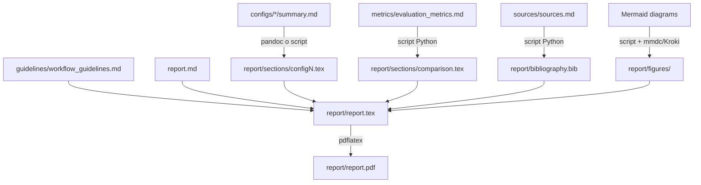

# Assembly Guide

> Spiega come i file componente della repo vengono assemblati nel report finale e come garantire che modifiche ai file componente si propaghino automaticamente all'output.

---

## Filosofia di assemblaggio

La repo è strutturata come un **sistema modulare a layers**:

```
Layer 0: Dati grezzi (brainstorming, prompt originale)
Layer 1: Analisi strutturata (configs, metrics, tools)
Layer 2: Aggregazioni (sources, examples, cross_references)
Layer 3: Output finale (report.tex → report.pdf)
```

**Principio chiave:** Il report LaTeX NON contiene dati duplicati — li referenzia o li include da file esterni tramite `\input{}` e `\includegraphics{}`. Se un file componente cambia, ricompilare il LaTeX produce un output aggiornato.

---

## Struttura del Report LaTeX

### Struttura attuale - Iterazione 03

```
report/
+-- report.tex              <- entry point compatibile: \input{main}
+-- main.tex                <- preambolo, titlepage, TOC, \input{} modulari
+-- sections/
|   +-- software_logic.tex  <- logica CAD/mesh/CFD/HEEDS
|   +-- recommendations.tex <- risposte guida e ranking finale
+-- iterations/
|   +-- iter1_solidworks_starccm_heeds.tex
|   +-- iter2_nx_starccm_heeds.tex
+-- bibliography.bib
+-- figures/
```

Per compilare:

```bash
cd report
pdflatex -interaction=nonstopmode -halt-on-error report.tex
bibtex report
pdflatex -interaction=nonstopmode -halt-on-error report.tex
pdflatex -interaction=nonstopmode -halt-on-error report.tex
```

### Struttura target storica

```
report/
├── report.tex              ← file principale (solo struttura)
├── sections/
│   ├── intro.tex           ← \input{sections/intro}
│   ├── config1.tex         ← generato da configs/config_1.../summary.md
│   ├── config2.tex         
│   ├── config3.tex         
│   ├── comparison.tex      ← tabella comparativa generata da metrics/
│   └── conclusions.tex     
├── figures/
│   ├── workflow_general.pdf    ← Mermaid → PDF
│   ├── workflow_config1.pdf    
│   ├── workflow_config2.pdf    
│   └── workflow_config3.pdf    
└── bibliography.bib        ← generato da sources/sources.md
```

---

## Pipeline di assemblaggio



---

## Script di assemblaggio

### Step 1 — Convertire Mermaid in figure

```bash
# Lo script usa mmdc se disponibile; altrimenti usa Kroki.
python scripts/render_mermaid_figures.py

# Output: report/figures/industry_examples/*.mmd, *.svg, *.png + manifest
```

---

### Step 2 — Generare la tabella comparativa

```python
# scripts/build_comparison_table.py
"""Legge i punteggi dai YAML header dei config summaries e genera comparison.tex"""
import yaml, pathlib

configs = []
for f in sorted(pathlib.Path("configs").glob("*/summary.md")):
    with open(f) as fh:
        content = fh.read()
    # Estrae YAML header
    meta = yaml.safe_load(content.split("---")[1])
    configs.append({
        "name": meta["title"],
        "score": meta["score"],
        "rank": meta["rank"],
        "status": meta["status"]
    })

configs.sort(key=lambda x: x["rank"])

# Genera LaTeX table
latex = r"""
\begin{table}[h]
\centering
\caption{Confronto configurazioni workflow}
\begin{tabular}{clcc}
\toprule
Rank & Configurazione & Score & Status \\
\midrule
"""
for c in configs:
    latex += f"{c['rank']} & {c['name'].split('—')[1].strip()} & {c['score']:.2f}/5.00 & {c['status']} \\\\\n"
latex += r"""\bottomrule
\end{tabular}
\end{table}
"""

with open("report/sections/comparison.tex", "w") as f:
    f.write(latex)
print("✅ comparison.tex generato")
```

---

### Step 3 — Generare bibliography.bib da sources.md

```python
# scripts/build_bibliography.py
"""Converte le tabelle in sources/sources.md in formato BibTeX"""
import re

# Nota: per fonti web usare @misc, per paper @article
BIB_TEMPLATE_MISC = """@misc{{{key},
  title = {{{title}}},
  howpublished = {{\\url{{{url}}}}},
  note = {{Accessed: {date}. Reliability: {reliability}}},
  year = {{{year}}}
}}
"""

# Parsing semplificato (estende per il caso reale)
with open("sources/sources.md") as f:
    content = f.read()

# ... parsing delle tabelle markdown ...
# Genera bibliography.bib
print("✅ bibliography.bib generato")
```

---

### Step 4 — Build completo

```bash
#!/bin/bash
# scripts/build_all.sh — assembla tutto il progetto

echo "=== STEP 1: Estrazione e conversione figure Mermaid ==="
python scripts/render_mermaid_figures.py

echo "=== STEP 2: Generazione tabella comparativa ==="
python scripts/build_comparison_table.py

echo "=== STEP 3: Generazione bibliography ==="
python scripts/build_bibliography.py

echo "=== STEP 4: Compilazione LaTeX ==="
cd report/
pdflatex -interaction=nonstopmode report.tex
biber report
pdflatex -interaction=nonstopmode report.tex
pdflatex -interaction=nonstopmode report.tex  # terza pass per ref cross

echo "=== STEP 5: Verifica output ==="
[ -f "report.pdf" ] && echo "✅ report.pdf generato" || echo "❌ Compilazione fallita"
cd ..
```

---

## Come aggiornare un singolo file componente

Se modifichi `configs/config_1_openvsp_su2/summary.md`:

1. Aggiorna il YAML header (`last_updated`, `score` se cambiato)
2. Ri-esegui `python scripts/build_comparison_table.py`
3. Se hai modificato i diagrammi Mermaid, ri-esegui `python scripts/render_mermaid_figures.py`
4. Ri-compila il LaTeX: `cd report && pdflatex report.tex`
5. Committa: `git commit -am "update: config_1 [descrizione modifica]"`

---

## File unico finale — nota

Il `report/report.pdf` è il **documento finale unico** che aggrega tutto. Non è un file markdown perché:
- Supporta figure vettoriali, tabelle complesse, numeri di pagina, TOC
- Si aggiorna automaticamente ricompilando quando cambiano i file componente
- È il formato standard per documentazione tecnica

Per avere un **preview rapido web** (senza compilare LaTeX), si può generare `report/report.html` con:
```bash
pandoc report/report.tex -o report/report.html --standalone --mathjax
```
