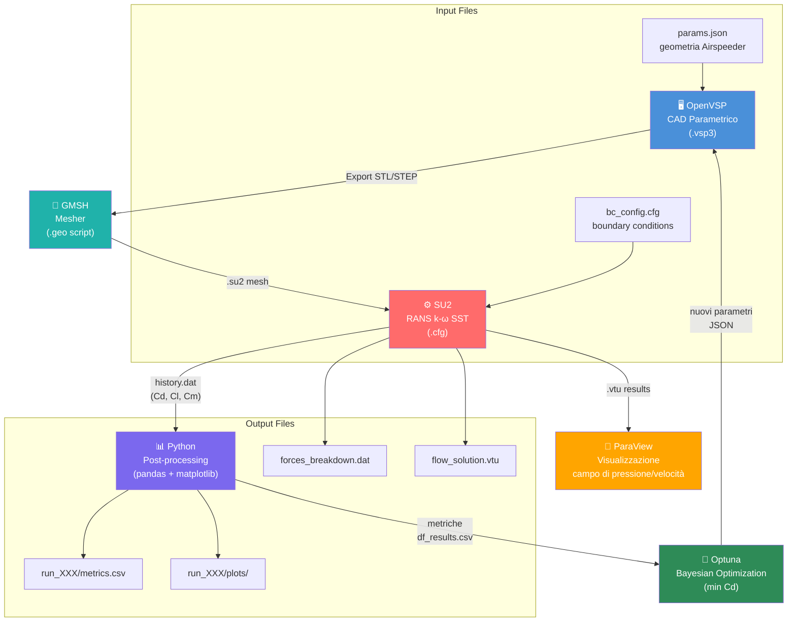

# Config 1 — OpenVSP + GMSH + SU2

> **Raccomandazione:** ✅ Configurazione principale consigliata per il progetto Airspeeder Mk3

---

## Diagramma del workflow



---

## Valutazione con metriche

| Criterio | Peso | Voto | Punteggio ponderato |
|---|---|---|---|
| Tipo di analisi supportate | 15% | 4 | 0.60 |
| Accuratezza delle analisi | 20% | 4 | 0.80 |
| Integrabilità con altri software | 15% | 5 | 0.75 |
| Costo licenze | 15% | 5 | 0.75 |
| Scalabilità | 10% | 4 | 0.40 |
| Compatibilità OS | 10% | 5 | 0.50 |
| Supporto formati | 15% | 4 | 0.60 |
| **TOTALE** | **100%** | — | **4.40 / 5.00** |

---

## Dettaglio tecnico

### CAD: OpenVSP
- Parametrizzazione geometria Airspeeder tramite `vsp_model.py`
- Export automatico in `.stl` per meshing
- Parametri tipici: chord length, sweep angle, fuselage radius, nacelle diameter

### Meshing: GMSH
- Script `.geo` per mesh ibrida (boundary layer strutturata + tetraedri non strutturati lontano dalla parete)
- Tre livelli di raffinamento per mesh sensitivity study
- Boundary layer: first cell height `y+ ≈ 1` per k-ω SST

| Livello mesh | Celle totali (stima) | Tempo calcolo SU2 |
|---|---|---|
| Coarse | ~500K | ~15 min |
| Medium | ~1.5M | ~45 min |
| Fine | ~4M | ~2h |

### Solver: SU2
- Modello turbolenza: k-ω SST (raccomandato per flussi con separazione)
- Schema numerico: AUSM+ per flusso compressibile o Roe per incompressibile
- Condizioni al contorno: freestream velocity, no-slip walls, farfield

### Post-processing: Python + ParaView
- Script `post_process.py` estrae Cd, Cl, Cm da `forces_breakdown.dat`
- ParaView per visualizzazione distribuzione pressione, linee di flusso, zone di separazione

---

## Formati file — interoperabilità

```
OpenVSP → [.stl] → GMSH → [.su2] → SU2 → [.vtu] → ParaView
                                        → [.csv] → Python/Optuna
```

| Passaggio | Formato | Standard? | Note |
|---|---|---|---|
| OpenVSP → GMSH | `.stl` | Sì | Verificare che la mesh sia watertight |
| GMSH → SU2 | `.su2` | Sì (SU2 nativo) | Export diretto da GMSH |
| SU2 → ParaView | `.vtu` (VTK) | Sì | Standard de facto |
| SU2 → Python | `.csv`, `.dat` | Sì | Facile da leggere con pandas |

---

## Vantaggi

- ✅ Tutto open source, zero costi di licenza
- ✅ Installazione nativa su Windows (critico per il team)
- ✅ SU2 sviluppato specificamente per ottimizzazione aerodinamica
- ✅ Python API per OpenVSP + subprocess per SU2 → automazione completa
- ✅ Formati standard ovunque
- ✅ Comunità attiva, documentazione buona

## Svantaggi

- ⚠️ SU2 meno flessibile di OpenFOAM per fisica non standard
- ⚠️ GMSH richiede script `.geo` — curva di apprendimento iniziale
- ⚠️ Aeroacustica non supportata nativamente (richiederebbe Actran o OpenFOAM)

---

## Setup rapido

```bash
# 1. Installa dipendenze
pip install openvsp gmsh numpy scipy pandas optuna matplotlib

# 2. Scarica e installa SU2
# https://su2code.github.io/download.html
# Aggiungi SU2_RUN al PATH

# 3. Verifica
SU2_CFD --help
python -c "import openvsp; print('OpenVSP OK')"
python -c "import gmsh; print('GMSH OK')"
```

---

## File di configurazione SU2 (template)

```cfg
% ---- Problema ----
SOLVER= RANS
KIND_TURB_MODEL= SST
MATH_PROBLEM= DIRECT

% ---- Condizioni freestream ----
MACH_NUMBER= 0.1
AOA= 0.0
SIDESLIP_ANGLE= 0.0
FREESTREAM_PRESSURE= 101325.0
FREESTREAM_TEMPERATURE= 288.15

% ---- Mesh ----
MESH_FILENAME= airspeeder_medium.su2
MESH_FORMAT= SU2

% ---- Output ----
OUTPUT_FILES= PARAVIEW, SURFACE_PARAVIEW
CONV_FILENAME= history
VOLUME_FILENAME= flow_solution
SURFACE_FILENAME= surface_flow

% ---- Convergenza ----
CONV_RESIDUAL_MINVAL= -9
MAX_ITER= 5000
```
