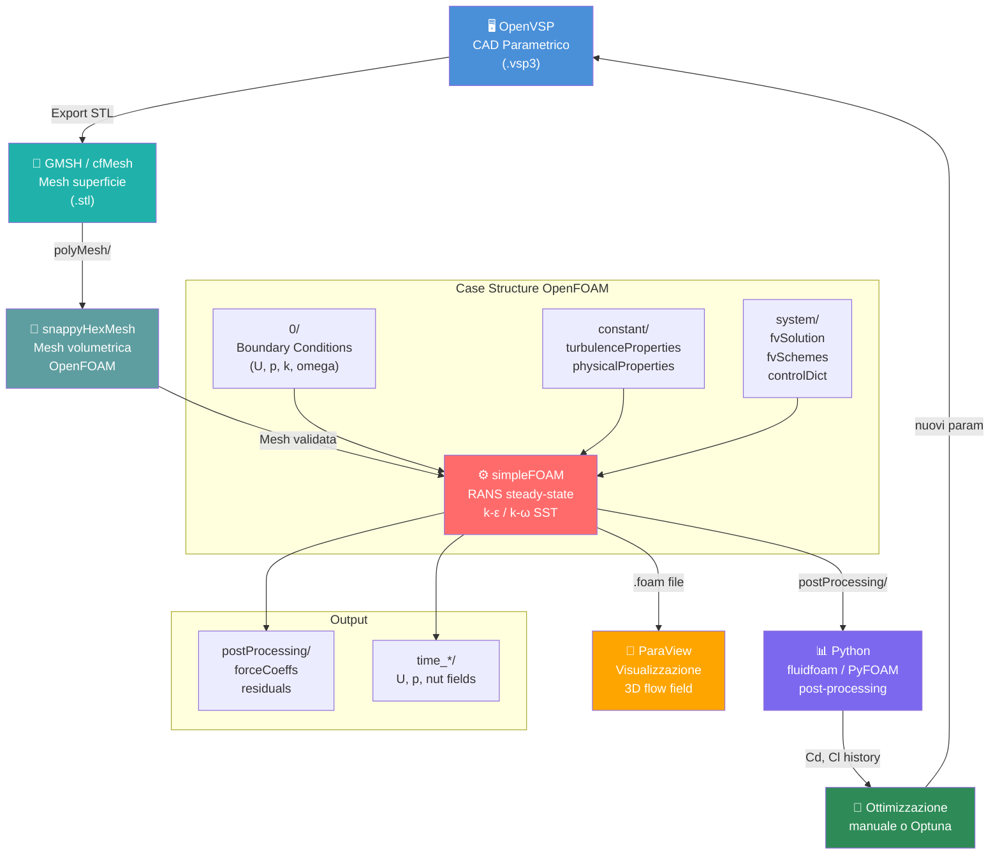

# Config 2 — OpenVSP + GMSH + OpenFOAM

> **Raccomandazione:** ⚠️ Alternativa per analisi ad alta fedeltà — maggiore accuratezza ma complessità operativa più elevata. Consigliata per validazione finale o analisi dettagliate dopo screening con Config 1.

---

## Diagramma del workflow



---

## Valutazione con metriche

| Criterio | Peso | Voto | Punteggio ponderato |
|---|---|---|---|
| Tipo di analisi supportate | 15% | 5 | 0.75 |
| Accuratezza delle analisi | 20% | 5 | 1.00 |
| Integrabilità con altri software | 15% | 4 | 0.60 |
| Costo licenze | 15% | 5 | 0.75 |
| Scalabilità | 10% | 5 | 0.50 |
| Compatibilità OS | 10% | 3 | 0.30 |
| Supporto formati | 15% | 4 | 0.60 |
| **TOTALE** | **100%** | — | **4.50 / 5.00** |

> **Nota:** Nonostante il punteggio grezzo sia leggermente superiore alla Config 1, la compatibilità OS (voto 3 per la complessità su Windows via WSL2) e la curva di apprendimento più ripida abbassano la raccomandazione pratica. Per un team già operativo su Windows, Config 1 rimane preferibile come punto di partenza.

---

## Dettaglio tecnico

### Meshing con snappyHexMesh

snappyHexMesh genera mesh esaedriche con raffinamento locale attorno alla geometria — qualità superiore rispetto a GMSH per flussi separati complessi.

```
blockMesh → mesh cartesiana grezza
snappyHexMesh → taglio geometria + boundary layers
checkMesh → verifica qualità
```

Parametri critici:
- `maxNonOrtho < 70`
- `maxSkewness < 4`
- `minVol > 0` (no celle degenerate)

### Solver: simpleFOAM

Per analisi steady-state incompressibile (Ma < 0.3, tipico per Airspeeder a velocità di gara):

```
application     simpleFOAM;
nOuterCorrectors 50;
pRefCell        0;
pRefValue       0;
```

Modello turbolenza consigliato: **k-ω SST** (stesso di SU2 per confronto diretto).

### Struttura case OpenFOAM

```
airspeeder_case/
├── 0/
│   ├── U          (velocity BC)
│   ├── p          (pressure BC)
│   ├── k          (TKE BC)
│   └── omega      (specific dissipation BC)
├── constant/
│   ├── turbulenceProperties
│   └── physicalProperties
└── system/
    ├── controlDict
    ├── fvSchemes
    ├── fvSolution
    └── forceCoeffs  (post-processing drag/lift)
```

---

## Vantaggi rispetto a Config 1

- ✅ Maggiore accuratezza (mesh esaedrica strutturata di qualità superiore)
- ✅ Supporto LES/DES per analisi non stazionarie future
- ✅ `forceCoeffs` funzionDict per estrazione automatica Cd/Cl in-situ
- ✅ Aeroacustica via `acousticAnalogy` (Ffowcs Williams-Hawkings)
- ✅ Scalabilità MPI eccellente, testata su cluster HPC

## Svantaggi

- ⚠️ Setup su Windows complesso (richiede WSL2 + ~2h configurazione)
- ⚠️ snappyHexMesh richiede esperienza
- ⚠️ Tempi di setup molto più lunghi rispetto a SU2
- ⚠️ Debugging mesh problematica è difficile per chi inizia

---

## Strategia ibrida consigliata

```
Config 3 (XFLR5)   → Screening preliminare, ~30 min/run
Config 1 (SU2)     → Ottimizzazione iterativa, ~1h/run  
Config 2 (OpenFOAM)→ Validazione finale, ~4h/run
```

Usare Config 2 solo per validare il design ottimale trovato con Config 1.
