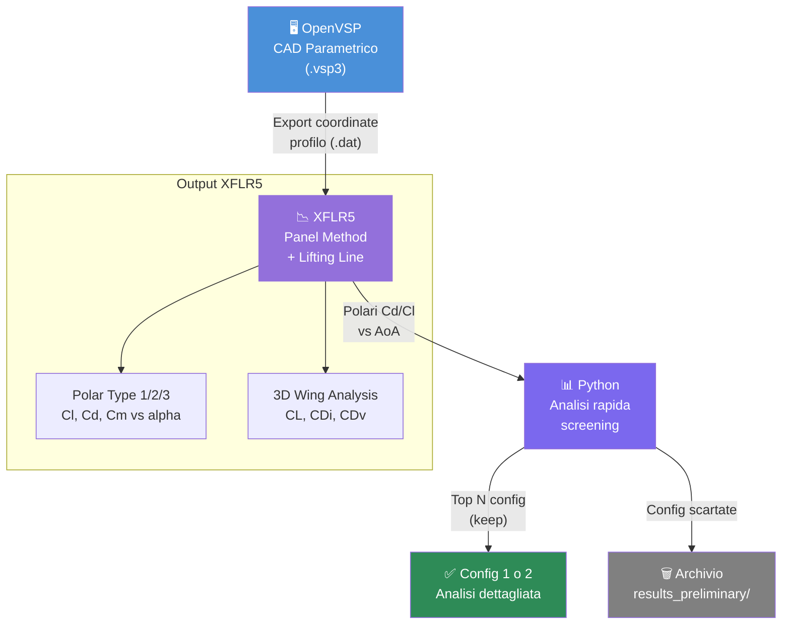

# Config 3 — OpenVSP + XFLR5

> **Raccomandazione:** 🔵 Solo per fase preliminare — velocità di calcolo eccellente, fidelity bassa. Da usare per scartare rapidamente configurazioni non promettenti prima di investire risorse in Config 1/2.

---

## Diagramma del workflow

---

## Valutazione con metriche

| Criterio | Peso | Voto | Punteggio ponderato |
|---|---|---|---|
| Tipo di analisi supportate | 15% | 2 | 0.30 |
| Accuratezza delle analisi | 20% | 2 | 0.40 |
| Integrabilità con altri software | 15% | 3 | 0.45 |
| Costo licenze | 15% | 5 | 0.75 |
| Scalabilità | 10% | 2 | 0.20 |
| Compatibilità OS | 10% | 5 | 0.50 |
| Supporto formati | 15% | 2 | 0.30 |
| **TOTALE** | **100%** | — | **2.90 / 5.00** |

---

## Dettaglio tecnico

### Limiti del metodo a pannelli
XFLR5 usa il metodo a pannelli 3D (Vortex Lattice Method + 3D panel method):
- Valido per **geometrie slender** (ali, fusoliere allungate)
- **Non adatto** per geometrie tozze o con separazione massiva
- Nessuna turbolenza modelizzata (flusso potenziale)
- Nessun effetto viscoso 3D (solo correzione 2D da profilo XFOIL)

Per l'Airspeeder Mk3, la struttura del telaio con gondole rotori, bracci e carrello è problematica per il panel method — i risultati saranno qualitativi, non quantitativi.

### Quando usarlo comunque
- Per valutare rapidamente l'effetto dell'angolo di attacco sulla portanza
- Per confrontare variazioni di profilo alare (se presenti superfici portanti)
- Come sanity check prima di lanciare simulazioni CFD costose

### Workflow pratico
1. Da OpenVSP, esportare coordinate profilo (sezione 2D) come `.dat`
2. Caricare in XFLR5, fare analisi XFOIL 2D
3. Costruire ala 3D semplificata con i profili
4. Fare analisi VLM o 3D panel
5. Leggere polari ed estrarre Cd/Cl vs AoA

---

## Vantaggi
- ✅ Calcolo in secondi/minuti (vs ore di CFD)
- ✅ Nessun setup mesh
- ✅ Ottimo per esplorare spazio parametrico ampio
- ✅ Zero costi, Windows nativo

## Svantaggi
- ❌ Accuratezza bassa per geometrie complesse 3D
- ❌ Nessuna viscosità 3D, separazione, scia non lineare
- ❌ Non automatizzabile facilmente (GUI-only)
- ❌ Non produce campo di flusso volumetrico
