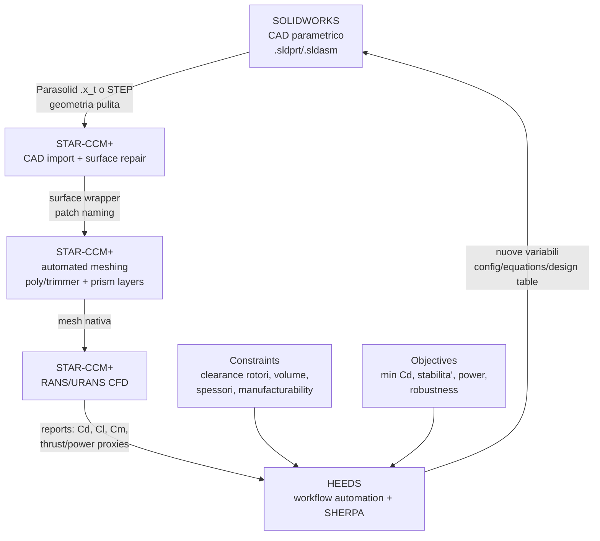

# Config 4 - SOLIDWORKS + STAR-CCM+ + HEEDS

> **Raccomandazione:** workflow valido se il team conosce gia' SOLIDWORKS e vuole un CAD meccanico rapido. Per un drone/eVTOL racing non e' la scelta commerciale migliore in assoluto, ma puo' funzionare bene con regole rigide su parametri, superfici, defeaturing ed export.

---

## Diagramma del workflow

---

## Valutazione con metriche

| Criterio | Peso | Voto | Punteggio ponderato |
|---|---|---|---|
| Tipo di analisi supportate | 15% | 5 | 0.75 |
| Accuratezza delle analisi | 20% | 4.5 | 0.90 |
| Integrabilita' con altri software | 15% | 4 | 0.60 |
| Costo licenze | 15% | 1 | 0.15 |
| Scalabilita' | 10% | 5 | 0.50 |
| Compatibilita' OS | 10% | 4 | 0.40 |
| Supporto formati | 15% | 4 | 0.60 |
| **TOTALE** | **100%** | - | **3.90 / 5.00** |

---

## Quando ha senso

- Il team progetta parti meccaniche, supporti, bracket, carenature e assiemi con una cultura SOLIDWORKS gia' forte.
- Si vuole prototipare rapidamente una geometria drone senza investire subito nella curva di apprendimento NX.
- Il modello CAD puo' essere ridotto a un set stabile di parametri: raggi carenature, sezioni bracci, sweep/angoli, dimensioni fairing, raccordi e clearance.
- STAR-CCM+ viene usato come ambiente CFD principale, incluse mesh e post-processing.

## Rischi principali

- SOLIDWORKS e' ottimo su meccanica parametrica, ma meno naturale di NX per superfici aerodinamiche aerospace complesse, compositi e continuita' PLM/CAE Siemens.
- In ottimizzazione automatica, features fragili, fillet che falliscono o superfici rinominate possono rompere il loop HEEDS.
- Export STL da CAD verso CFD va evitato come formato principale: meglio Parasolid `.x_t` o STEP per preservare topologia e superfici.
- Serve una "simulation CAD configuration" separata dalla configurazione produttiva: semplificata, watertight e con naming stabile.

## Parametri modificabili da HEEDS

| Gruppo | Esempi parametri |
|---|---|
| Bracci/telaio | sezione bracci, raccordi, fairing ratio, angolo bracci, distanza da rotori |
| Fuseliera/carenatura | nose radius, tail taper, cross-section ratio, posizione canopy/fairing |
| CFD | livello mesh, refinement locale, prism layer total thickness, criteri stop |
| Operazioni | velocita' cruise, yaw/alpha, casi hover/cruise, vincoli su clearance |

**Nota:** i parametri numerici di mesh non vanno usati per "ottimizzare" il risultato aerodinamico finale; servono per robustezza e costo. La mesh finale va validata con mesh independence.

---

## Decisione sintetica

SOLIDWORKS + STAR-CCM+ + HEEDS e' una pipeline industriale credibile, soprattutto se il valore sta nel CAD meccanico rapido e nel downstream CFD/optimization di Siemens. Per il nostro campo applicativo droni/eVTOL, pero', e' inferiore a NX quando il progetto richiede superfici aerodinamiche avanzate, compositi, gestione del digital thread e automazione CAD-CAE piu' profonda.
