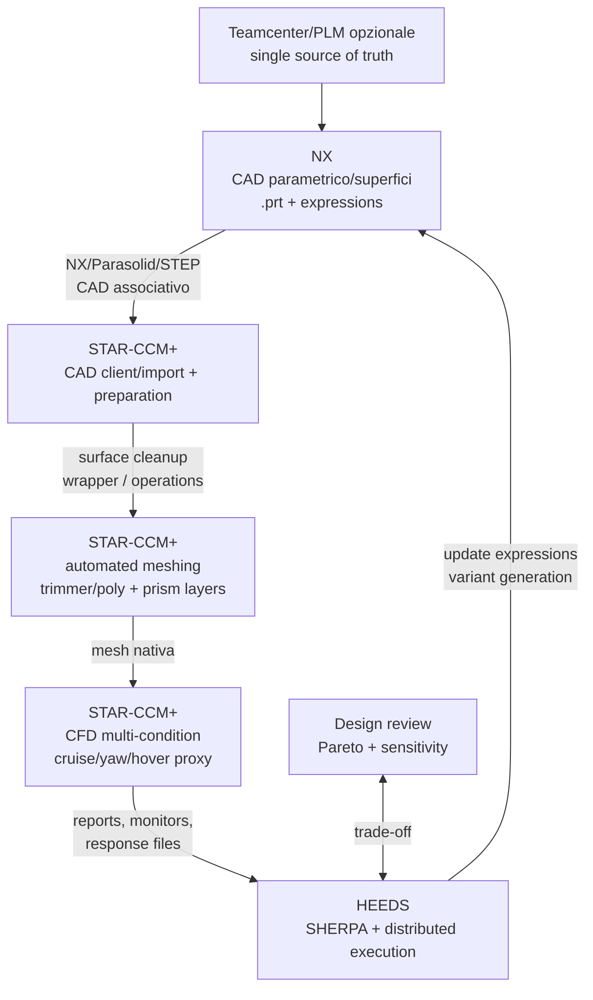

# Config 5 - NX + STAR-CCM+ + HEEDS

> **Raccomandazione:** miglior stack proprietario tra i due casi studio per applicazioni droni/eVTOL racing. NX e' piu' coerente con superfici aerodinamiche, aerostrutture, compositi, master model e integrazione Simcenter; STAR-CCM+ e HEEDS completano il ciclo CFD/ottimizzazione.

---

## Diagramma del workflow

---

## Valutazione con metriche

| Criterio | Peso | Voto | Punteggio ponderato |
|---|---|---|---|
| Tipo di analisi supportate | 15% | 5 | 0.75 |
| Accuratezza delle analisi | 20% | 4.5 | 0.90 |
| Integrabilita' con altri software | 15% | 5 | 0.75 |
| Costo licenze | 15% | 1 | 0.15 |
| Scalabilita' | 10% | 5 | 0.50 |
| Compatibilita' OS | 10% | 4 | 0.40 |
| Supporto formati | 15% | 5 | 0.75 |
| **TOTALE** | **100%** | - | **4.20 / 5.00** |

---

## Perche' e' piu' adatto a droni/eVTOL

- Siemens posiziona NX con una pagina specifica per aerospace, UAV e urban air mobility.
- NX gestisce meglio di SOLIDWORKS superfici complesse, continuita' aerodinamica, direct editing/synchronous technology e modelli ibridi.
- Il master model riduce il rischio che CAD, simulazione e manufacturability divergano tra loro durante l'ottimizzazione.
- L'integrazione con Simcenter/Teamcenter facilita un digital thread industriale: CAD, simulation, risultati, varianti e decisioni restano tracciabili.
- In un workflow HEEDS, le expressions e i parametri NX sono piu' naturali da orchestrare quando si rimane nel portfolio Siemens.

## Rischi principali

- Costo licenze e curva di apprendimento sono alti.
- Il valore emerge solo se il team usa davvero parametri robusti, template, naming standards e automazione; usare NX come "semplice CAD" non giustifica il costo.
- Per un progetto didattico o open replicabile, resta necessario mantenere una baseline OpenVSP/GMSH/SU2 o OpenFOAM.

## Parametri modificabili da HEEDS

| Gruppo | Esempi parametri |
|---|---|
| Aerodinamica telaio | nose/tail curvature, cross-section morphing, fairing thickness, braccio airfoil-like ratio |
| Integrazione rotori | hub fairing, support strut angle, rotor clearance, duct/fairing optional |
| Vincoli struttura/produzione | spessori minimi, volume, massa proxy, composite layup proxy, accessibilita' |
| Casi CFD | cruise drag, yaw stability, hover/cruise compromise, cooling inlets se inclusi |

---

## Decisione sintetica

NX + STAR-CCM+ + HEEDS e' il miglior benchmark proprietario per il progetto Airspeeder-like. Non sostituisce la baseline open se la priorita' e' replicabilita' senza licenze, ma rappresenta il modo piu' coerente di impostare un workflow industriale CAD/CFD/optimization per droni complessi.
