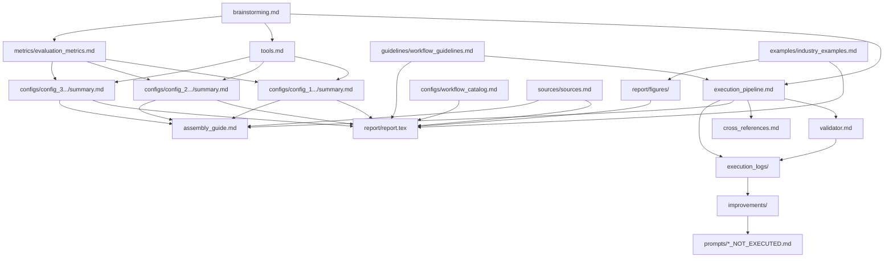

# Cross References

> Mappa completa delle dipendenze tra file della repo. Serve per garantire che quando si opera su un file, tutti i suoi prerequisiti esistano già. Usare questo file insieme a `execution_pipeline.md` per pianificare l'ordine di generazione/modifica.

---

## Diagramma delle dipendenze



---

## Matrice dipendenze dettagliata

### File fondamentali (nessuna dipendenza)

| File | Dipende da | Produce per |
|---|---|---|
| `brainstorming.md` | — (file originale) | `execution_pipeline.md`, `tools.md`, `metrics/` |
| `prompts/main_prompt_original.md` | — (input utente) | `prompts/main_prompt_optimized.md` |
| `guidelines/workflow_guidelines.md` | — (regole operative) | `execution_pipeline.md`, `report/report.tex`, nuove iterazioni |

---

### Layer 1 — Setup

| File | Dipende da | Produce per |
|---|---|---|
| `execution_pipeline.md` | `brainstorming.md` | Tutti i file successivi |
| `tools.md` | `brainstorming.md` | `configs/*/summary.md`, `report/` |
| `metrics/evaluation_metrics.md` | `brainstorming.md` | `configs/*/summary.md`, `report/` |
| `token_saving_techniques.md` | — | Tutte le sessioni LLM |

---

### Layer 2 — Contenuto

| File | Dipende da | Produce per |
|---|---|---|
| `configs/config_1_openvsp_su2/summary.md` | `tools.md`, `metrics/evaluation_metrics.md` | `report/report.tex`, `assembly_guide.md` |
| `configs/config_2_openvsp_openfoam/summary.md` | `tools.md`, `metrics/evaluation_metrics.md` | `report/report.tex`, `assembly_guide.md` |
| `configs/config_3_xflr5_preliminary/summary.md` | `tools.md`, `metrics/evaluation_metrics.md` | `report/report.tex`, `assembly_guide.md` |
| `configs/workflow_catalog.md` | `examples/industry_examples.md`, `metrics/evaluation_metrics.md` | `report/report.tex`, comparazioni future |
| `sources/sources.md` | — (ricerca web) | `report/report.tex`, `examples/` |
| `examples/industry_examples.md` | `sources/sources.md` | `report/report.tex` |

---

### Layer 3 — Infrastruttura

| File | Dipende da | Produce per |
|---|---|---|
| `validator.md` | `execution_pipeline.md` | `execution_logs/` |
| `cross_references.md` | Tutti i file Layer 1+2 | LLM execution context |
| `assembly_guide.md` | `configs/*/summary.md`, `sources/`, `examples/` | `report/report.tex` |
| `report.md` | — (reference di stile) | `report/report.tex` |
| `report/figures/*` | Markdown con blocchi Mermaid | `report/report.tex` |

---

### Layer 4 — Output finale

| File | Dipende da | Produce per |
|---|---|---|
| `report/report.tex` | Tutti i Layer precedenti | Output finale PDF |
| `execution_logs/log_*.md` | Ogni sessione di esecuzione | `improvements/` |
| `improvements/iteration_*.md` | `execution_logs/` | `prompts/*_NOT_EXECUTED.md` |

---

## Aggiunte Iterazione 03

| File | Dipende da | Produce per |
|---|---|---|
| `tutorials.md` | `sources/sources.md`, ricerca web | Onboarding software e report futuri |
| `results/iteration_03_cad_starccm_heeds_analysis.md` | `sources/sources.md`, `configs/workflow_catalog.md`, config 4/5 | `report/iterations/`, `improvements/` |
| `configs/config_4_solidworks_starccm_heeds/summary.md` | `tools.md`, `metrics/evaluation_metrics.md`, `sources/sources.md` | `report/iterations/iter1_solidworks_starccm_heeds.tex` |
| `configs/config_5_nx_starccm_heeds/summary.md` | `tools.md`, `metrics/evaluation_metrics.md`, `sources/sources.md` | `report/iterations/iter2_nx_starccm_heeds.tex` |
| `report/main.tex` | `report/sections/*`, `report/iterations/*`, `report/bibliography.bib` | `report/report.tex`, `report/report.pdf` |
| `report/sections/software_logic.tex` | `sources/sources.md`, `tools.md` | `report/main.tex` |
| `report/sections/recommendations.tex` | risultati iterazione 03, config 4/5 | `report/main.tex` |
| `report/iterations/iter1_solidworks_starccm_heeds.tex` | config 4, risultati iterazione 03 | `report/main.tex` |
| `report/iterations/iter2_nx_starccm_heeds.tex` | config 5, risultati iterazione 03 | `report/main.tex` |
| `prompts/iteration_03_cad_starccm_heeds_request.md` | input utente | log iterazione 03 |
| `prompts/iteration_03_cad_starccm_heeds_optimized.md` | prompt originale iterazione 03 | log iterazione 03 |

---

## Regole di sequenziamento

### Regola 1 — Non saltare i layer
Non è possibile generare un file di Layer N se i file di Layer N-1 non esistono.

```
❌ SBAGLIATO: Generare report.tex prima di avere i config summaries
✅ CORRETTO: brainstorming → tools + metrics → configs → report
```

### Regola 2 — Modifiche a cascata
Se si modifica un file, tutti i file che ne dipendono devono essere riesaminati.

| File modificato | File da riesaminare |
|---|---|
| `metrics/evaluation_metrics.md` | Tutti i `configs/*/summary.md`, `report/report.tex` |
| `tools.md` | Tutti i `configs/*/summary.md` |
| Qualsiasi `configs/*/summary.md` | `report/report.tex`, `assembly_guide.md` |
| `sources/sources.md` | `report/report.tex` (sezione bibliografia) |
| `examples/industry_examples.md` | `report/figures/`, `report/report.tex` |
| `guidelines/workflow_guidelines.md` | `execution_pipeline.md`, `cross_references.md`, `report/report.tex` |

### Regola 3 — Operazioni in coppia
Alcuni file vanno sempre generati/aggiornati insieme:

| Coppia | Motivo |
|---|---|
| `prompts/*_original.md` + `prompts/*_optimized.md` | Sempre in coppia |
| `execution_logs/log_XX.md` + `improvements/iteration_XX.md` | Fine di ogni iterazione |
| Aggiornamento config + aggiornamento `cross_references.md` | Coerenza |
| Nuovo prompt operativo + commit locale | Tracciabilità della pipeline |
| Mermaid modificato + rigenerazione `report/figures/` | Coerenza tra markdown e immagini |

---

## Checklist prima di generare un file

Per ogni file che stai per generare, verifica:

- [ ] Tutti i file in "Dipende da" esistono e sono validati?
- [ ] Hai caricato solo il context module necessario (non tutta la repo)?
- [ ] Il file che generi ha l'header YAML corretto?
- [ ] Hai aggiornato questa matrice se stai aggiungendo un nuovo file?
