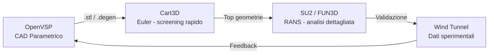
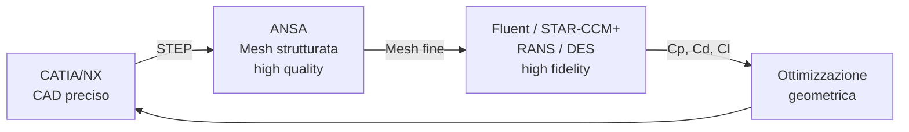
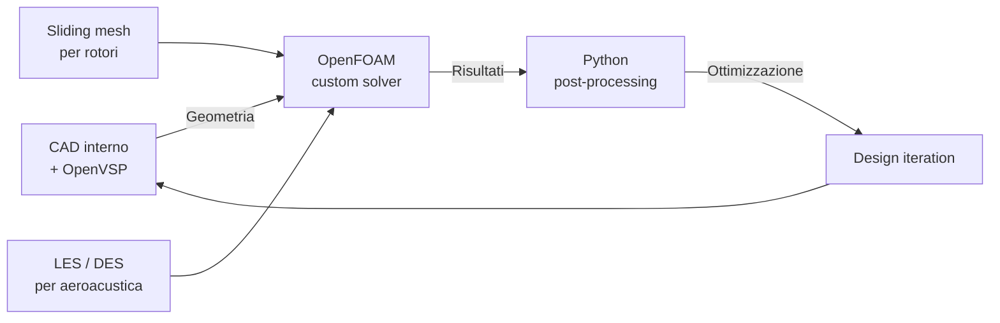
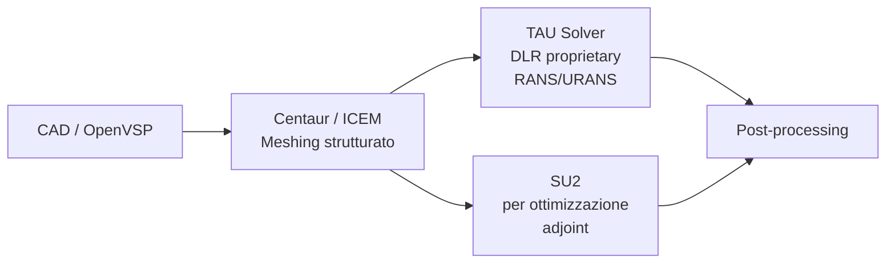

# Esempi di Workflow CFD — Aziende Leader del Settore

> Questi esempi mostrano come aziende consolidate strutturano i loro workflow aerodinamici. **Avvertenza:** il fatto che un'azienda usi un certo stack non implica che sia la soluzione ottimale — garantisce solo che funzioni in produzione. Alcune aziende leader nella produzione possono essere conservative nell'adozione di nuovi strumenti rispetto a contesti accademici o startup.

---

## 1. NASA — OpenVSP + SU2 + Cart3D

**Settore:** Aerospace (ricerca e sviluppo)  
**Stack:** OpenVSP → Cart3D (analisi preliminare) → SU2/FUN3D (analisi dettagliata) → OVERFLOW (rotorcraft)  
**Fonte:** https://openvsp.org / https://su2code.github.io/tutorials/

### Logica del workflow

**Perché è rilevante per Airspeeder Mk3:**
- NASA usa OpenVSP come standard per parametrizzazione — validazione diretta della scelta Config 1
- Il pattern "Euler fast screening → RANS detailed" è analogo a Config 3 → Config 1 in questo progetto
- SU2 è sviluppato con il contributo diretto di NASA (AIAA paper 2024-4304)

**Limiti dell'esempio:** NASA lavora su geometrie aeronautiche convenzionali, non su quadricotteri racing. I modelli di turbolenza potrebbero richiedere calibrazione per il caso Airspeeder.

---

## 2. Formula 1 — Ansys Fluent + STAR-CCM+ (stack commerciale)

**Settore:** Motorsport  
**Stack:** CATIA/NX (CAD) → ANSA (meshing) → Ansys Fluent / STAR-CCM+ (CFD) → EnSight (post)  
**Fonte:** Articoli tecnici SAE International, documentazione Ansys per F1

### Logica del workflow

**Perché è rilevante:**
- Il motorsport è il contesto più vicino all'Airspeeder (competizione + ottimizzazione drag)
- Conferma che RANS k-ω SST è lo standard per ottimizzazione drag in racing
- Dimostra che l'approccio iterativo CAD → CFD → ottimizzazione è consolidato

**Limiti:** Stack completamente commerciale, costi di licenza proibitivi (Ansys Fluent > €50.000/anno). Non replicabile direttamente; l'open source equivalent è Config 1 o Config 2.

**Alternativa open source equivalente:** OpenVSP + GMSH + SU2 (Config 1) per il 95% delle capacità a costo zero.

---

## 3. Joby Aviation — OpenFOAM + Custom Toolchain (eVTOL)

**Settore:** eVTOL / Urban Air Mobility  
**Stack:** Proprietario (basato su OpenFOAM) → analisi rotor-frame interaction  
**Fonte:** Paper tecnici Joby su AIAA, job postings (indicativi dello stack)

### Logica del workflow

**Perché è rilevante:**
- Joby lavora su eVTOL — architettura simile all'Airspeeder
- Conferma che OpenFOAM è lo standard per analisi rotor-body interaction su eVTOL
- L'analisi dell'interazione rotore-fusoliera (che il presente progetto non include ma potrebbe in futuro) richiede sliding mesh — solo OpenFOAM o solver commerciali

**Limiti:** Il workflow Joby è altamente personalizzato e non documentato pubblicamente. Le inferenze si basano su paper AIAA e profili LinkedIn degli ingegneri.

---

## 4. DLR (Deutsches Zentrum für Luft- und Raumfahrt) — SU2 + FLOWer

**Settore:** Aerospazio (ricerca pubblica)  
**Stack:** CAD interno → TAU (solver DLR) / SU2 → ParaView  
**Fonte:** DLR technical reports, SU2 validation papers

### Logica del workflow

**Perché è rilevante:**
- DLR usa SU2 specificamente per ottimizzazione con metodo adjoint — caso d'uso identico alla minimizzazione drag Airspeeder
- Conferma la scelta di SU2 per workflow di ottimizzazione gradient-based

---

## 5. Alauda Aeronautics (costruttore Airspeeder) — Stack non divulgato

**Settore:** eVTOL Racing  
**Stack:** Non divulgato pubblicamente  
**Fonte:** https://airspeeder.com, comunicati stampa

**Cosa sappiamo:**
- Il team è composto da ingegneri provenienti da Airbus, Boeing, Ferrari, MagniX, McLaren (fonte: S14)
- 350+ test flights Mk3 completati — il design è già validato sperimentalmente
- Focus su: aerodinamica, powertrain elettrico, sistemi di controllo

**Inferenza ragionevole:** Data la composizione del team (provenienza Airbus/Boeing), è probabile che usino tool commerciali (Fluent/STAR-CCM+) o OpenFOAM per analisi interne.

**Implicazione per questo progetto:** Avere dati di volo reali dell'Mk3 (se accessibili) sarebbe il punto di validazione ideale per qualsiasi simulazione CFD.

---

## Confronto stack industriali

| Azienda | Stack | Open Source? | Adatto al progetto? |
|---|---|---|---|
| NASA | OpenVSP + SU2 + Cart3D | ✅ Sì | ✅ Direttamente replicabile |
| F1 Teams | CATIA + Fluent/STAR-CCM+ | ❌ No | ⚠️ Solo come riferimento metodologico |
| Joby Aviation | OpenFOAM custom | ✅ Parzialmente | ✅ Rilevante per evoluzione futura |
| DLR | SU2 + TAU | ⚠️ Parzialmente | ✅ SU2 parte direttamente usabile |
| Alauda/Airspeeder | Non divulgato | ❓ Sconosciuto | ⭐ Fonte primaria ideale |

---

## Takeaway per questo progetto

1. **Il pattern OpenVSP → SU2 è validato da NASA** per esattamente questo tipo di workflow parametrico-ottimizzazione
2. **OpenFOAM è lo standard per eVTOL** quando serve analisi rotor-body interaction (futuro)
3. **RANS k-ω SST** è il modello di turbolenza standard sia in F1 che in aerospazio per ottimizzazione drag
4. **L'approccio "screening veloce → analisi dettagliata"** (Config 3 → Config 1 → Config 2) è esattamente il pattern usato da NASA e ricerca aerospaziale
5. **I team di F1 fanno centinaia di run CFD** per variazione parametrica — conferma che il workflow automatizzato (Optuna + SU2) è la direzione giusta
