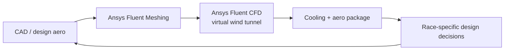
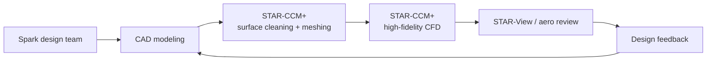
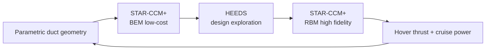
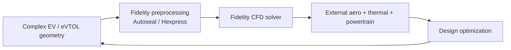
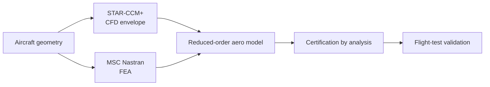
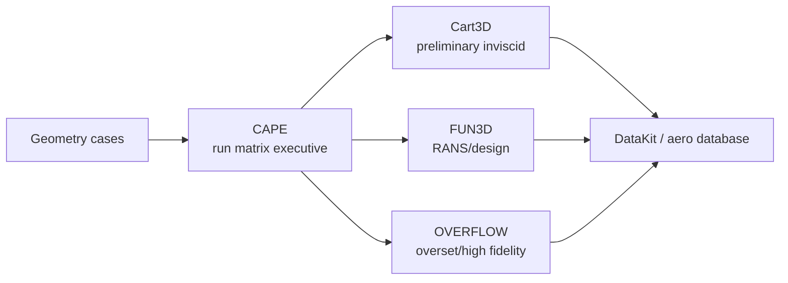
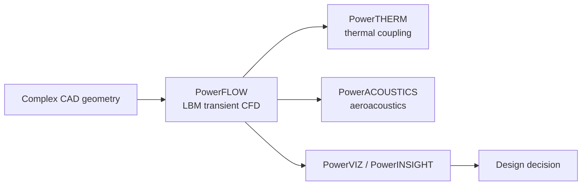
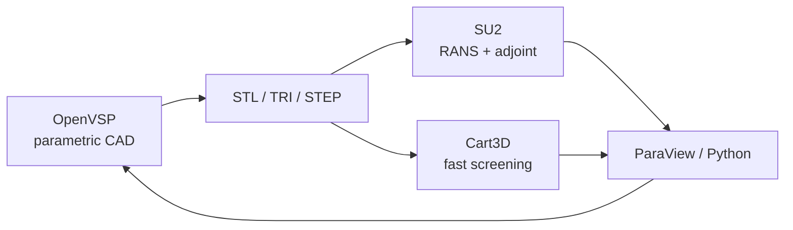
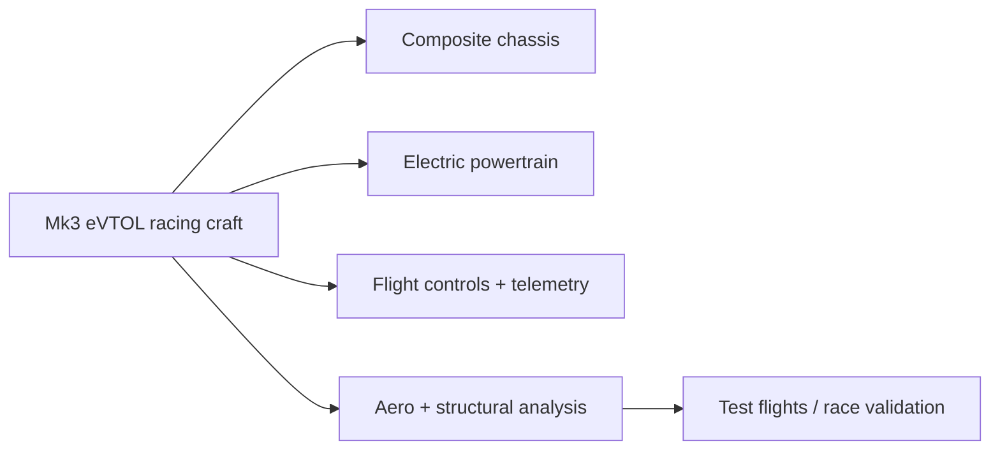
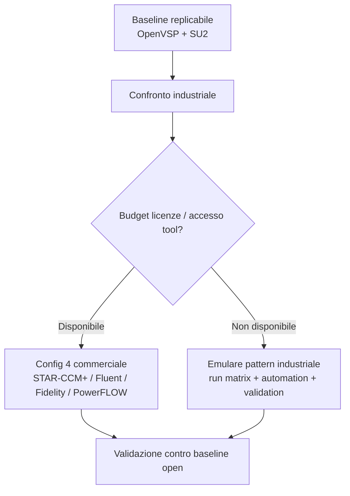

# Esempi di Workflow CFD — Aziende Leader del Settore

> Aggiornamento mirato alla priorità **Altissima** dell'iterazione 01: ricerca più esaustiva degli esempi industriali, includendo più stack proprietari.

## Nota di valutazione temporanea

Per questa run il peso dell'open source è stato ridotto intenzionalmente. La domanda qui non è "quale workflow costa meno", ma "quali workflow risultano più credibili se guardiamo a eVTOL, racing, certificazione e uso industriale reale". Quindi:

- il costo/licenza resta annotato, ma non penalizza pesantemente;
- hanno più peso maturità industriale, automazione, robustezza del meshing, casi reali e capacità HPC;
- le configurazioni open source restano utili come baseline replicabile, ma non sono favorite a priori.

---

## 1. Oracle Red Bull Racing — Ansys Fluent come virtual wind tunnel

**Settore:** Formula 1 / motorsport ad alta iterazione
**Stack verificato:** Ansys Fluent Meshing -> Ansys Fluent CFD -> Ansys Granta MI / LS-DYNA per domini non aerodinamici
**Fonte:** S25

**Perché è rilevante per Airspeeder Mk3**

- È il riferimento più vicino al concetto di racing: iterazioni frequenti, vincoli regolamentari, finestra decisionale breve.
- Conferma che una pipeline proprietaria può essere scelta come "virtual wind tunnel" centrale quando serve affidabilità industriale.
- Il focus non è solo drag puro: raffreddamento e integrazione power unit diventano importanti appena il modello Airspeeder include powertrain e packaging.

**Limite:** non è eVTOL; il caso riguarda veicoli ground-effect e automotive racing, quindi non trasferisce direttamente rotor-body interaction.

---

## 2. Spark Racing Technology / AOTECH — Simcenter STAR-CCM+ in Formula E

**Settore:** Formula E / motorsport elettrico
**Stack verificato:** CAD -> Simcenter STAR-CCM+ surface cleaning + meshing + simulation -> STAR-View / post-processing
**Fonte:** S28

**Perché è rilevante**

- È motorsport elettrico, quindi più vicino all'Airspeeder rispetto alla Formula 1 termica.
- Il caso esplicita una catena CAD/simulazione/post-processing molto fluida tra team design e aerodinamica.
- La simulazione del front wing è riportata come caso complesso da 200 milioni di celle: utile come scala di riferimento per future workstation/HPC.

**Implicazione:** se il progetto evolve verso benchmark proprietario, STAR-CCM+ è una delle opzioni più forti per una Config 4 commerciale.

---

## 3. Martin UAV V-BAT — STAR-CCM+ + HEEDS per VTOL duct optimization

**Settore:** UAV / VTOL ducted fan
**Stack verificato:** Simcenter STAR-CCM+ -> Simcenter HEEDS -> centinaia/migliaia di design duct -> validazione hover/cruise
**Fonte:** S26

**Perché è rilevante**

- È il caso più vicino al problema eVTOL: compromesso tra hover e cruise, propulsione/duct, geometrie non convenzionali.
- Mostra una logica multi-fidelity: BEM per esplorare rapidamente, RBM per i candidati promettenti.
- La pipeline include ottimizzazione automatizzata, non solo singole simulazioni.

**Risultato industriale utile come benchmark:** Siemens riporta +5.8% hover thrust e -3.8% cruise power sul duct ottimizzato.

---

## 4. Honda — Cadence Fidelity CFD per EV/eVTOL

**Settore:** automotive EV + eVTOL
**Stack verificato:** Cadence Fidelity CFD platform; Fidelity preprocessing/meshing; solver e post-processing nello stesso ecosistema
**Fonti:** S29, S30

**Perché è rilevante**

- Honda è citata da Cadence sia su eVTOL sia su applicazioni critiche come external aerodynamics, thermal management, power unit e drivetrain.
- La piattaforma punta su workflow end-to-end: riduce il rischio di perdere tempo tra tool separati.
- Per Airspeeder diventa interessante se si vuole una pipeline commerciale meno frammentata rispetto a CAD + mesher + solver separati.

**Limite:** le informazioni pubbliche sono sintetiche e commerciali; ottime per orientare lo stack, non sufficienti per replicare i dettagli.

---

## 5. TLG Aerospace — STAR-CCM+ + MSC Nastran per certification by analysis

**Settore:** certificazione aerospaziale
**Stack verificato:** Simcenter STAR-CCM+ per CFD + MSC Nastran per FEA -> full-vehicle model -> database aeroelastiche/flight envelope
**Fonte:** S27

**Perché è rilevante**

- Non è un caso racing, ma è un caso forte di credibilità industriale: CFD usata per supportare certificazione e ridurre test.
- Mostra che il valore vero del CFD non è solo il Cd, ma la costruzione di database aerodinamici riusabili.
- Per Airspeeder, anticipa una possibile evoluzione: da "ottimizzazione drag" a "database aero + stabilità + carichi".

---

## 6. NASA CAPE / Cart3D / FUN3D / OVERFLOW — grandi matrici CFD

**Settore:** aerospace pubblico / mission-critical CFD
**Stack verificato:** CAPE come run matrix executive -> Cart3D, FUN3D, OVERFLOW -> DataKit / database aerosciences
**Fonti:** S32, S33, S34

**Perché è rilevante**

- CAPE nasce per gestire matrici di run molto grandi, anche oltre 1000 casi.
- NASA riporta un esempio Artemis I basato su oltre 25.000 simulazioni Cart3D.
- Cart3D è un riferimento per screening preliminare automatizzato, mentre FUN3D copre analisi/design CFD più avanzato.

**Implicazione per Airspeeder:** anche se non si usa CAPE direttamente, la logica da copiare è: run matrix, naming rigoroso, database risultati, restart e post-processing automatico.

---

## 7. Dassault SIMULIA PowerFLOW — Lattice Boltzmann per aero/aeroacustica

**Settore:** transportation, mobility, aerospace & defense
**Stack verificato:** PowerFLOW -> PowerTHERM / PowerACOUSTICS / PowerVIZ / PowerINSIGHT
**Fonte:** S31

**Perché è rilevante**

- PowerFLOW importa geometrie complesse e automatizza la discretizzazione senza volume/boundary-layer meshing manuale.
- È forte quando l'aeroacustica diventa importante, anche se nel progetto attuale è secondaria.
- Supporta moving geometries e Local Reference Frames, quindi è interessante per futuri scenari con rotori.

**Limite:** licenza proprietaria e workflow meno replicabile in una repo open.

---

## 8. NASA / OpenVSP + SU2 — baseline open-source ancora valida

**Settore:** aerospace research / open-source simulation
**Stack:** OpenVSP -> mesh/geometry export -> SU2 / Cart3D / altri solver -> ParaView/post-processing
**Fonti:** S01, S03, S17, S33

**Perché resta rilevante**

- È il workflow più replicabile a costo licenza zero.
- SU2 resta adatto a ottimizzazione PDE-constrained e adjoint.
- OpenVSP resta naturale per parametrizzazione aeronautica rapida.

**Correzione rispetto alla prima iterazione:** non va più trattato come "automaticamente migliore" solo perché open source. In questa run, è il baseline low-cost da confrontare contro workflow industriali proprietari.

---

## 9. Alauda / Airspeeder — stack non divulgato, ma vincoli chiari

**Settore:** eVTOL racing
**Stack pubblico:** non divulgato
**Fonti:** S35, S36

**Cosa è verificabile pubblicamente**

- Alauda descrive il Mk3 come macchina racing elettrica pura per EXA Series, con telaio in fibra di carbonio e alta manovrabilità.
- Airspeeder dichiara l'ingresso di talenti da Boeing, Jaguar Land Rover, Renault F1, McLaren, Williams Racing e Vertical Airspace.
- Il team cita competenze su analisi aerodinamica, strutturale, flight controls, telemetry e compositi.

**Inferenza prudente**

Dato il mix motorsport/aerospace e la natura eVTOL racing, è ragionevole aspettarsi un workflow proprietario o ibrido, con strumenti commerciali per CFD/strutture e tool interni per test/telemetria. Non c'è però disclosure pubblica sufficiente per nominare un solver usato da Alauda.

---

## Confronto aggiornato degli stack industriali

| Caso | Stack dominante | Proprietario? | Rilevanza Airspeeder | Cosa insegna |
|---|---|---:|---:|---|
| Red Bull Racing | Ansys Fluent | Sì | Alta | Virtual wind tunnel robusto per iterazioni racing |
| Spark/AOTECH Formula E | STAR-CCM+ | Sì | Alta | Workflow CAD/CFD/post-processing fluido in motorsport elettrico |
| Martin UAV V-BAT | STAR-CCM+ + HEEDS | Sì | Molto alta | VTOL optimization multi-fidelity hover/cruise |
| Honda EV/eVTOL | Cadence Fidelity CFD | Sì | Molto alta | End-to-end platform per geometrie complesse e eVTOL |
| TLG Aerospace | STAR-CCM+ + Nastran | Sì | Media-Alta | Database aero per certificazione e flight envelope |
| NASA CAPE | CAPE + Cart3D/FUN3D/OVERFLOW | Parziale | Alta | Run matrix, database, automazione su migliaia di casi |
| Dassault PowerFLOW | SIMULIA PowerFLOW | Sì | Alta futura | Aeroacustica, moving geometry, LBM transient CFD |
| OpenVSP + SU2 | Open source | No | Alta | Baseline replicabile e ottimizzazione adjoint |
| Alauda/Airspeeder | Non divulgato | Sconosciuto | Massima | Vincoli reali e target di validazione |

---

## Takeaway per il progetto Airspeeder Mk3

1. **La Config 1 OpenVSP + SU2 resta la baseline replicabile**, ma non va più favorita solo per assenza di licenze.
2. **Un benchmark commerciale è giustificato**: STAR-CCM+, Ansys Fluent, Cadence Fidelity o PowerFLOW meritano una Config 4 futura, anche solo come confronto metodologico.
3. **Per eVTOL/rotori il pattern migliore è multi-fidelity**: BEM o modelli rapidi per esplorazione, RBM/sliding mesh/LES per candidati finali.
4. **La metrica dovrebbe distinguere tra "workflow da repo open" e "workflow industriale target"**: sono due obiettivi diversi.
5. **Il valore industriale sta nella run matrix**, non nella singola simulazione: naming, gestione fallimenti, database risultati e post-processing automatico sono centrali.
6. **Aeroacustica resta secondaria oggi**, ma PowerFLOW/Cadence/STAR-CCM+ indicano che diventerà importante quando si includono rotori, noise footprint e race operations.

---

## Raccomandazione operativa aggiornata

Per la prossima iterazione tecnica, senza implementare ancora task di priorità inferiore:

**Decisione consigliata:** mantenere OpenVSP + SU2 come workflow principale di repo, ma documentare una Config 4 commerciale come benchmark industriale appena si passa alla priorità Alta/Media.
