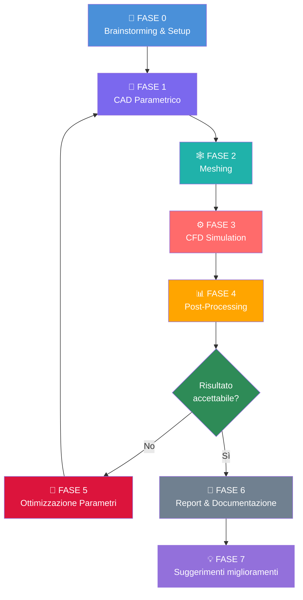
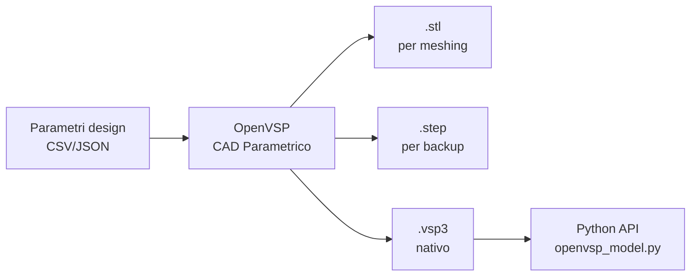
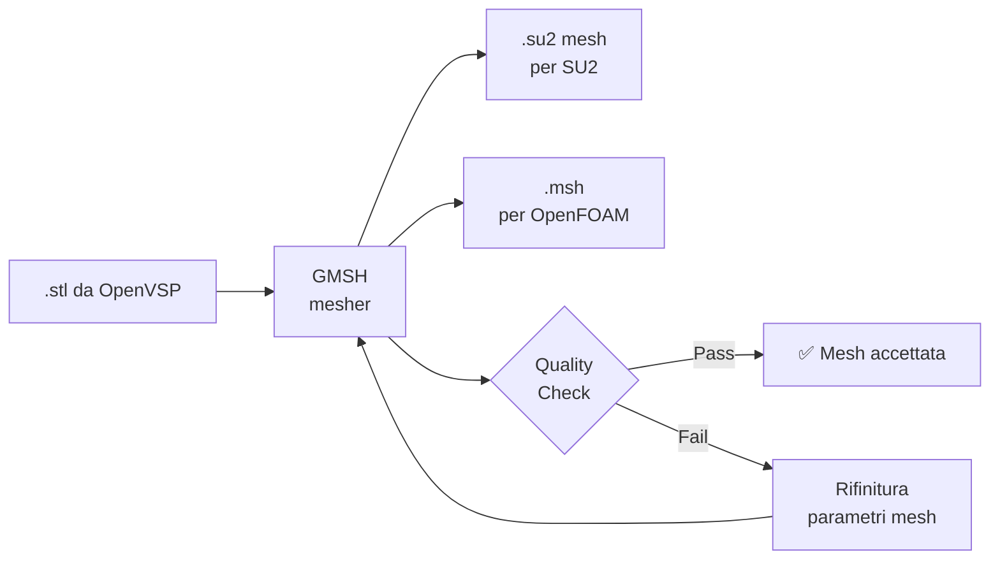
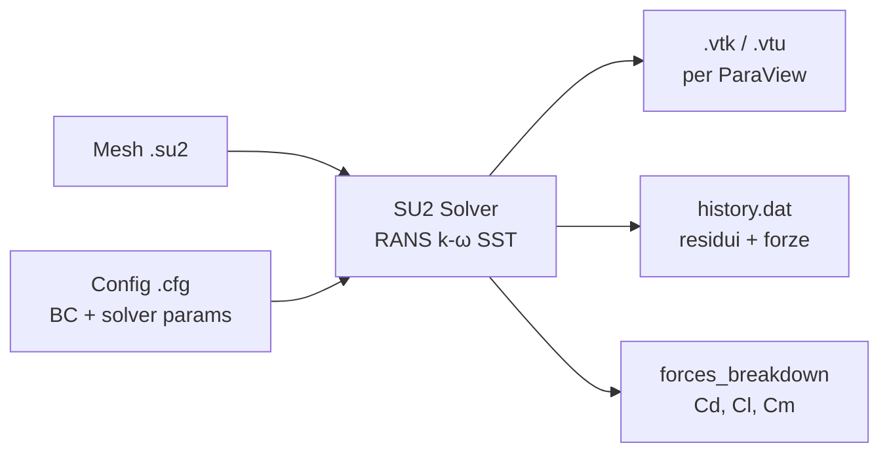

# Execution Pipeline — Airspeeder Mk3 Aero Workflow

> Questo file guida un LLM (o un ingegnere) nell'esecuzione ordinata del progetto. Ogni passo ha input, output e criterio di validazione. Consultare [`cross_references.md`](cross_references.md) per le dipendenze tra file e [`guidelines/workflow_guidelines.md`](guidelines/workflow_guidelines.md) per le regole di processo e commit.

---

## Diagramma generale

---

## Passi dettagliati

### FASE 0 — Brainstorming & Setup
**Input:** Requisiti di progetto, vincoli del team, [`guidelines/workflow_guidelines.md`](guidelines/workflow_guidelines.md)
**Output:** [`brainstorming.md`](brainstorming.md), struttura repo, file di config iniziale  
**Azione LLM:** Leggere il prompt originale, generare brainstorming grezzo, creare struttura repo e salvare ogni prompt operativo in `prompts/`
**Validazione:** Tutti i file fondamentali esistono (check [`cross_references.md`](cross_references.md))  
**Checkpoint:** Commit iniziale della repo

---

### FASE 1 — CAD Parametrico
**Input:** Specifiche geometriche Airspeeder Mk3, parametri di design  
**Output:** File `.vsp3` (OpenVSP), export `.stl` / `.stp`  
**Tool:** OpenVSP ≥ 3.40  
**Azione LLM:** Generare script Python per parametrizzazione e export automatico  
**Dipendenze:** Nessuna  
**Validazione:** Geometria chiusa (no gaps), volume positivo, export riuscito  
**Checkpoint:** Salvare `configs/baseline.vsp3`, `configs/baseline.stl`

---

### FASE 2 — Meshing
**Input:** File geometria (`.stl` o `.stp`)  
**Output:** File mesh (`.su2`, `.msh`, o OpenFOAM `polyMesh/`)  
**Tool:** GMSH ≥ 4.11 oppure mesher interno SU2  
**Azione LLM:** Generare script `.geo` per GMSH con parametri di raffinamento  
**Validazione:** Mesh quality check (skewness < 0.85, orthogonality), mesh sensitivity study (3 livelli)  
**Checkpoint:** Salvare `mesh/baseline_coarse.su2`, `mesh/baseline_medium.su2`, `mesh/baseline_fine.su2`

---

### FASE 3 — CFD Simulation
**Input:** File mesh, file configurazione solver  
**Output:** File risultati (`.vtu` / `.vtk` per ParaView), file log con convergenza  
**Tool:** SU2 ≥ 7.5 (Config 1) oppure OpenFOAM ≥ 10 (Config 2)  
**Azione LLM:** Generare file `.cfg` (SU2) o `system/` directory (OpenFOAM)  
**Validazione:** Residui < 10⁻⁶, forze convergono entro 1%, nessun NaN  
**Checkpoint:** Salvare `results/run_XXX/` con config + risultati + log

---

### FASE 4 — Post-Processing
**Input:** File risultati CFD  
**Output:** Plot pressione/velocità, valore Cd/Cl, report numerico  
**Tool:** ParaView ≥ 5.11, Python (matplotlib, pandas)  
**Azione LLM:** Generare script Python di post-processing automatico  
**Validazione:** Valori Cd nell'intervallo fisicamente plausibile, immagini generate correttamente  
**Checkpoint:** Salvare `results/run_XXX/plots/` e `results/run_XXX/metrics.csv`

---

### FASE 5 — Ottimizzazione Parametri
**Input:** Risultati FASE 4, spazio parametrico definito, obiettivo (min Cd)  
**Output:** Nuovi parametri CAD per iterazione successiva  
**Tool:** Optuna (Bayesian optimization) o SLSQP (scipy)  
**Azione LLM:** Generare script optimizer che chiama OpenVSP API → GMSH → SU2 in loop  
**Validazione:** Funzione obiettivo decresce, parametri restano nei bounds  
**Checkpoint:** Salvare `optimization/history.csv`, aggiornare `improvements/`

---

### FASE 6 — Report & Documentazione
**Input:** Tutti i file precedenti  
**Output:** [`report/report.tex`](report/report.tex) compilato, figure in `report/figures/`, README aggiornato
**Azione LLM:** Assemblare il report LaTeX aggregando dati dai file markdown, usando `report.md` e le guidelines come riferimento di stile
**Validazione:** Report compila senza errori, tutte le figure presenti, riferimenti corretti, manifest figure aggiornato

---

### FASE 7 — Suggested Improvements
**Input:** Log di esecuzione, risultati finali, validazione  
**Output:** `improvements/iteration_XX_improvements.md`  
**Azione LLM:** Analizzare cosa ha funzionato/fallito e proporre prompt migliorato per iterazione successiva  
**Checkpoint:** Nuovo file prompt nella cartella `prompts/` con suffisso `_NOT_EXECUTED`

---

## Regole per l'LLM

1. **Non saltare i checkpoint** — ogni fase deve produrre file salvati prima di passare alla successiva
2. **Validare sempre prima di procedere** — una mesh non valida invalida tutto il CFD downstream
3. **Se una fase fallisce** — scrivere il motivo nel log corrispondente in `execution_logs/`, non bloccarsi
4. **Context window limitata** — usare [`token_saving_techniques.md`](token_saving_techniques.md) e caricare solo il context module rilevante per ogni fase
5. **Naming convention stabile** — `run_001`, `run_002`, ecc. — mai rinominare file già loggati
6. **Separazione reasoning/generation** — prima ragiona (scrivi reasoning nel brainstorming), poi genera
7. **Commit locali per blocchi logici** — dopo ogni modifica sostanziale eseguire validazione minima e commit con messaggio descrittivo
8. **Guidelines come reference** — per scelte di processo, commenti, metadata e reportistica consultare sempre [`guidelines/workflow_guidelines.md`](guidelines/workflow_guidelines.md)

---

## Context modules per fase

Per eseguire una singola fase in una chat separata, caricare:

| Fase | File da caricare |
|---|---|
| 0 — Setup | Questo file + `brainstorming.md` + `guidelines/workflow_guidelines.md` |
| 1 — CAD | `execution_pipeline.md` + `tools.md` + config scelta |
| 2 — Mesh | `execution_pipeline.md` + output Fase 1 |
| 3 — CFD | `execution_pipeline.md` + output Fase 2 |
| 4 — Post | `execution_pipeline.md` + output Fase 3 |
| 5 — Ottimizzazione | `execution_pipeline.md` + `metrics/evaluation_metrics.md` + `configs/workflow_catalog.md` + output Fase 4 |
| 6 — Report | `assembly_guide.md` + `report.md` + `guidelines/workflow_guidelines.md` + tutti gli output |
| 7 — Improvements | `execution_logs/` + `validator.md` |
