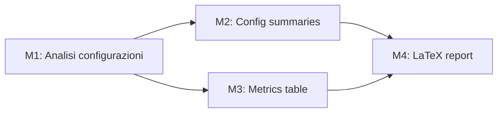

# Prompt Optimizer — Istruzioni Generali

> Come trasformare un prompt grezzo, monolitico o subottimale in un prompt strutturato, modulare e massimamente efficace. Queste istruzioni sono indipendenti dal dominio applicativo.

---

## Principi fondamentali

### 1. Un prompt = un obiettivo
Il prompt deve produrre **un solo artefatto** o rispondere a **una sola domanda**.
Se hai bisogno di 5 cose, scrivi 5 prompt separati.

```
❌ "Fammi la pipeline, il report, i grafici e il README"
✅ "Genera solo l'execution_pipeline.md con diagramma Mermaid"
```

### 2. Separare reasoning e generation
Mai chiedere di ragionare e produrre output nello stesso prompt.

```
PROMPT A (reasoning):
"Analizza i pro e contro di SU2 vs OpenFOAM per questa geometria.
Scrivi il tuo ragionamento. Non generare ancora codice."

PROMPT B (generation):
"Basandoti sull'analisi precedente, genera il file di configurazione SU2."
```

### 3. Specificare il formato di output
L'LLM non sa cosa vuoi se non glielo dici esplicitamente.

```
❌ "Dammi info su OpenFOAM"
✅ "Crea una tabella markdown con 5 righe (feature, voto 1-5, note) 
    sulle caratteristiche principali di OpenFOAM per analisi RANS."
```

---

## Struttura del prompt ottimizzato

```
[CONTESTO]       → Chi sei, qual è il progetto, vincoli chiave
[COMPITO]        → Cosa deve fare ESATTAMENTE
[RAGIONAMENTO]   → (opzionale) Come deve ragionare prima di generare  
[OUTPUT FORMAT]  → Formato esatto dell'output atteso
[VINCOLI]        → Cosa NON fare, cosa evitare
[ESEMPIO]        → (opzionale) Esempio di output desiderato
[VALIDAZIONE]    → Come verificare che l'output sia corretto
```

---

## Template XML universale

```xml
<context>
  <role>Sei un [ruolo specifico] che lavora su [progetto specifico]</role>
  <background>[Informazioni di contesto rilevanti — solo quelle necessarie]</background>
  <constraints>[Vincoli tecnici, preferenze, limiti]</constraints>
</context>

<task>
  <objective>[Cosa produrre in una frase]</objective>
  <instructions>
    [Istruzioni passo-passo se necessario]
    1. Prima fai X
    2. Poi fai Y
    3. Infine Z
  </instructions>
</task>

<output_format>
  <type>[markdown / codice Python / JSON / LaTeX / ...]</type>
  <structure>[Struttura attesa: sezioni, campi, lunghezza]</structure>
  <example>[Mini-esempio se utile]</example>
</output_format>

<validation>
  [Come so che l'output è corretto?]
  - Check 1: ...
  - Check 2: ...
</validation>
```

---

## Tecniche specifiche

### Tecnica 1: Chain-of-Thought esplicito
Forza il ragionamento prima della risposta finale.

```
"Prima di rispondere:
1. Elenca i pro e contro di ciascuna opzione
2. Identifica il vincolo più importante
3. Solo alla fine fornisci la raccomandazione"
```

### Tecnica 2: Few-shot examples
Mostra un esempio dell'output che vuoi.

```
"Il formato che voglio è questo:
| Software | Licenza | OS | Formato input |
|---|---|---|---|
| GMSH | GPL | Win/Lin/Mac | .stl, .stp |
Ora fai la stessa cosa per i solver CFD."
```

### Tecnica 3: Negative constraints
Specifica esplicitamente cosa NON vuoi.

```
"Non usare bullet points. Non scrivere paragrafi introduttivi. 
Non generare codice. Solo la tabella."
```

### Tecnica 4: Decomposizione modulare
Trasforma un prompt monolitico in una sequenza.

```
MONOLITICO: "Fammi tutto il progetto CFD"

MODULARE:
M1: "Genera solo la struttura della repo (cartelle e file vuoti)"
M2: "Genera solo brainstorming.md" 
M3: "Genera solo la config SU2 per il caso baseline"
...
```

### Tecnica 5: Ancoraggio al contesto
Collega il prompt a file esistenti invece di riscrivere il contesto.

```
"Leggi execution_pipeline.md (allegato). 
Basandoti SOLO sulla Fase 2 descritta lì, genera lo script GMSH."
```

### Tecnica 6: Role assignment
Assegnare un ruolo specifico migliora la qualità della risposta.

```
❌ "Dimmi come fare la mesh"
✅ "Sei un ingegnere CFD senior con 10 anni di esperienza con GMSH e SU2.
    Il tuo junior ha bisogno di istruzioni per meshare questa geometria STL."
```

### Tecnica 7: Progressive disclosure
Per output molto lunghi, costruire in passi.

```
STEP 1: "Genera solo lo scheletro (sezioni vuote con titoli)"
STEP 2: "Ora popola solo la Sezione 1"
STEP 3: "Ora la Sezione 2" ...
```

---

## Checklist pre-invio prompt

Prima di inviare un prompt, verifica:

- [ ] **Un obiettivo solo?** Se hai listato più "E poi..." → separa i prompt
- [ ] **Formato output specificato?** Markdown, JSON, codice, tabella...
- [ ] **Vincoli negativi inclusi?** Cosa NON fare?
- [ ] **Contesto minimo necessario?** Non sovraccaricare — solo ciò che serve per QUESTO task
- [ ] **Chain-of-thought se complesso?** Per decisioni multi-step, esplicitarlo
- [ ] **Esempio di output?** Se il formato è non ovvio, mostrare un esempio breve
- [ ] **Criterio di validazione?** Come sai che la risposta è giusta?

---

## Anti-pattern da evitare

| Anti-pattern | Problema | Soluzione |
|---|---|---|
| "Fai tutto in una volta" | Output enorme, difficile da validare | Decomposizione modulare |
| "Sai già tutto il contesto" | L'LLM non ricorda sessioni precedenti | Allegare sempre il context module |
| Prompt senza formato output | Output imprevedibile | Specificare sempre tipo e struttura |
| "Miglioralo" senza criteri | L'LLM non sa cosa migliorare | Specificare dimensione del miglioramento |
| Prompt narrativo lungo | Troppe informazioni → l'LLM si perde | Struttura XML/markdown |
| Chiedere opinion + fact + code | Tre task diversi → risposta confusa | Separa i prompt |

---

## Come trasformare un prompt monolitico in modulare

### Step 1 — Identifica tutti gli obiettivi nascosti
Leggi il prompt e sottolinea ogni verbo d'azione. Ogni verbo è un potenziale prompt separato.

### Step 2 — Costruisci il grafo delle dipendenze
Quali output del prompt A servono come input del prompt B?



### Step 3 — Assegna a ciascun modulo
- Un file di output preciso
- Il context module minimo necessario
- La fase di esecuzione (numerata)

### Step 4 — Aggiungi YAML metadata
Ogni file generato inizia con header YAML che dice cosa è, da dove dipende, cosa produce.

### Step 5 — Crea il file _NOT_EXECUTED.md
Salva il nuovo prompt modulare nella cartella `prompts/` con suffisso `_NOT_EXECUTED` finché non viene eseguito.
