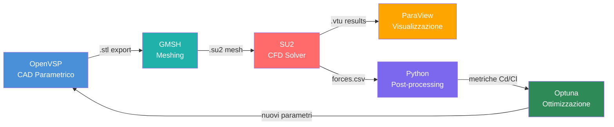

# Tools

> Tutti gli strumenti usati nel progetto, con versione consigliata, ruolo, link ufficiale e note di installazione.

---

## CAD Parametrico

### OpenVSP
| Campo | Valore |
|---|---|
| **Ruolo** | Modellazione CAD parametrica aeronautica |
| **Versione consigliata** | ≥ 3.40 |
| **Licenza** | Open source (NASA) |
| **OS** | Windows, Linux, macOS |
| **Sito** | https://openvsp.org |
| **Formati input** | `.vsp3` (nativo) |
| **Formati output** | `.stl`, `.stp`, `.obj`, `.degen`, `.vsp3` |
| **Python API** | Sì — `openvsp` package |
| **Note** | Progettato per geometrie aeronautiche; ottimo per parametrizzazione rapida di fusoliere, ali, gondole |

---

## Meshing

### GMSH
| Campo | Valore |
|---|---|
| **Ruolo** | Generazione mesh non strutturata 2D/3D |
| **Versione consigliata** | ≥ 4.11 |
| **Licenza** | Open source (GPL) |
| **OS** | Windows, Linux, macOS |
| **Sito** | https://gmsh.info |
| **Formati input** | `.stl`, `.stp`, `.iges`, `.brep`, `.geo` |
| **Formati output** | `.msh`, `.su2`, `.vtk`, `.cgns`, `.med` |
| **Python API** | Sì — `gmsh` package |
| **Note** | Altamente configurabile via file `.geo`; supporta raffinamento locale, boundary layers, mesh adattiva |

---

## Solver CFD

### SU2
| Campo | Valore |
|---|---|
| **Ruolo** | Solver CFD RANS per analisi aerodinamica |
| **Versione consigliata** | ≥ 7.5 |
| **Licenza** | Open source (LGPL) |
| **OS** | Windows, Linux, macOS |
| **Sito** | https://su2code.github.io |
| **Formati input** | `.su2` (mesh), `.cfg` (configurazione) |
| **Formati output** | `.vtu`, `.vtk`, `.csv` (forze), `history.dat` |
| **Python API** | Parziale — principalmente via config files + subprocess |
| **Note** | Sviluppato da Stanford; ottimo per ottimizzazione aerodinamica; supporto adjoint method per gradient-based optimization |

### OpenFOAM
| Campo | Valore |
|---|---|
| **Ruolo** | Solver CFD RANS/LES per analisi ad alta fedeltà |
| **Versione consigliata** | ≥ 10 (OpenFOAM.org) o ≥ v2306 (ESI) |
| **Licenza** | Open source (GPL) |
| **OS** | Linux nativo; Windows via WSL2 |
| **Sito** | https://openfoam.org |
| **Formati input** | `polyMesh/` (nativo), `.stl` (per snappyHexMesh) |
| **Formati output** | Formato OpenFOAM nativo, `.vtk`, `.foam` (ParaView) |
| **Python API** | Tramite `PyFOAM` o `fluidfoam` |
| **Note** | Altissima flessibilità; curva di apprendimento elevata; mesh con snappyHexMesh richiede pratica |

### XFLR5
| Campo | Valore |
|---|---|
| **Ruolo** | Analisi a bassa fedeltà (panel method + lifting line) |
| **Versione consigliata** | ≥ 6.60 |
| **Licenza** | Open source (GPL) |
| **OS** | Windows, Linux, macOS |
| **Sito** | http://www.xflr5.tech |
| **Formati input** | `.dat` (profili), coordinate geometria |
| **Formati output** | `.xml`, tabelle polari |
| **Python API** | No — interfaccia GUI |
| **Note** | Ottimo per screening preliminare; non adatto per geometrie 3D complesse come telaio Airspeeder |

---

## Post-Processing

### ParaView
| Campo | Valore |
|---|---|
| **Ruolo** | Visualizzazione e analisi risultati CFD |
| **Versione consigliata** | ≥ 5.11 |
| **Licenza** | Open source (BSD) |
| **OS** | Windows, Linux, macOS |
| **Sito** | https://www.paraview.org |
| **Formati input** | `.vtk`, `.vtu`, `.foam`, `.cgns`, `.ensight` |
| **Formati output** | Immagini, animazioni, CSV dati estratti |
| **Python API** | Sì — `pvpython` / `paraview.simple` |
| **Note** | Standard de facto per visualizzazione CFD open source |

### Python (scipy + matplotlib + pandas)
| Campo | Valore |
|---|---|
| **Ruolo** | Post-processing numerico, plotting, ottimizzazione |
| **Versione consigliata** | Python ≥ 3.9 |
| **Pacchetti chiave** | `numpy`, `scipy`, `matplotlib`, `pandas`, `optuna`, `openvsp` |
| **Note** | Collante tra tutti gli strumenti; automazione workflow, aggregazione risultati |

---

## Ottimizzazione

### Optuna
| Campo | Valore |
|---|---|
| **Ruolo** | Bayesian optimization per esplorazione spazio parametrico |
| **Licenza** | Open source (MIT) |
| **Sito** | https://optuna.org |
| **Note** | TPE (Tree-structured Parzen Estimator); ideale per ottimizzazione black-box dove ogni valutazione è costosa |

### SciPy SLSQP
| Campo | Valore |
|---|---|
| **Ruolo** | Ottimizzazione gradient-based locale |
| **Note** | Da usare dopo Optuna per raffinamento locale; richiede che la funzione obiettivo sia liscia |

---

## Versionamento & Collaborazione

### Git / GitHub
| Campo | Valore |
|---|---|
| **Ruolo** | Versionamento codice e file progetto |
| **Note** | Tutta la repo è versionata; usare branch per iterazioni di ottimizzazione; `.gitignore` per file mesh grandi |

### Git LFS
| Campo | Valore |
|---|---|
| **Ruolo** | Storage file grandi (mesh, risultati CFD) |
| **Note** | Necessario per file `.su2`, `.stl`, `.vtu` di grandi dimensioni |

---

## Documentazione

### LaTeX
| Campo | Valore |
|---|---|
| **Ruolo** | Report tecnico finale |
| **Distribuzione consigliata** | TeX Live (Linux) / MiKTeX (Windows) |
| **Note** | Compilare con `pdflatex` o `lualatex` |

### Mermaid
| Campo | Valore |
|---|---|
| **Ruolo** | Diagrammi workflow nei file markdown |
| **Note** | Renderizzato automaticamente su GitHub; usare nei file `.md` con blocchi ` ```mermaid ` |

---

## Stack consigliato per questo progetto


